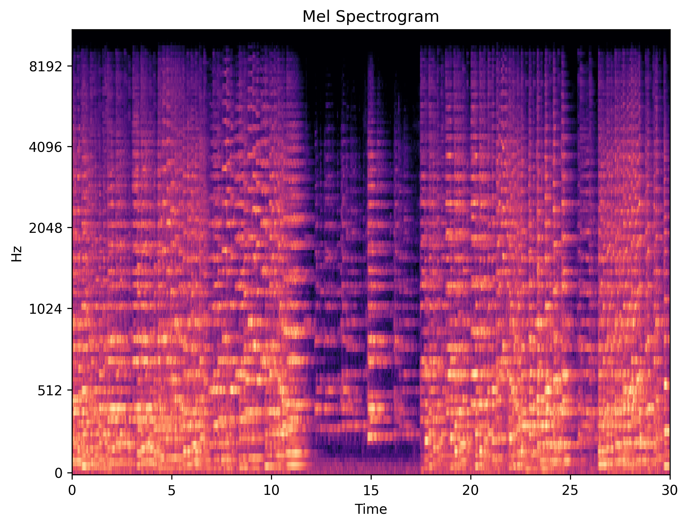
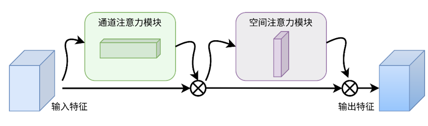
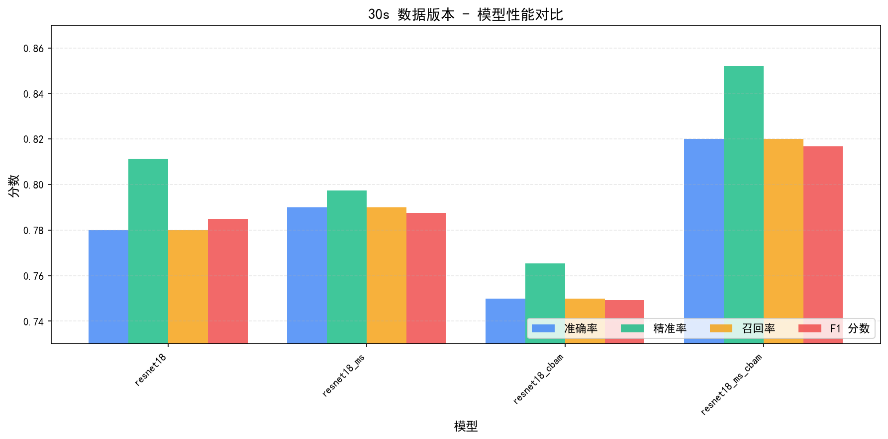
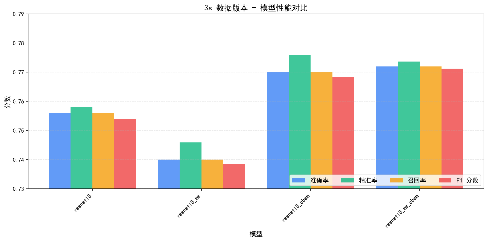
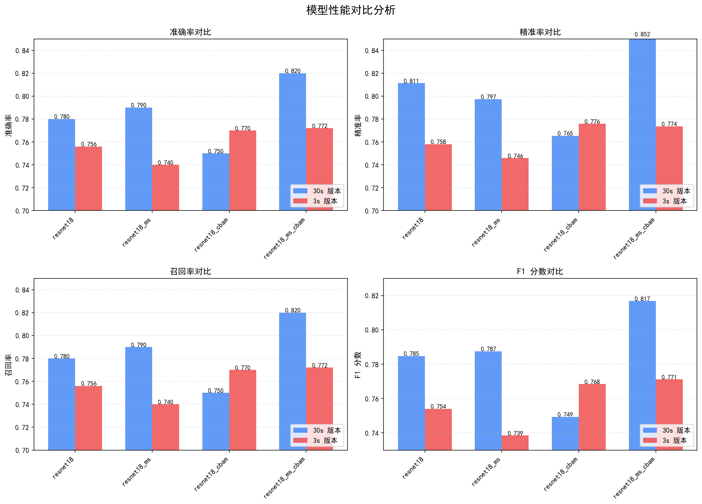
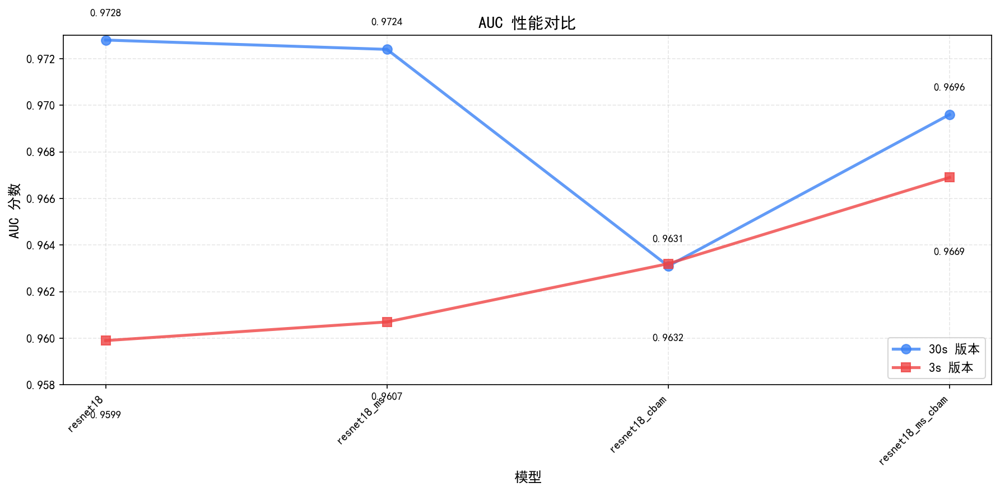
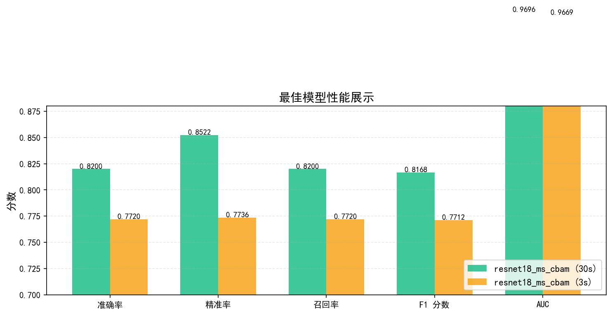
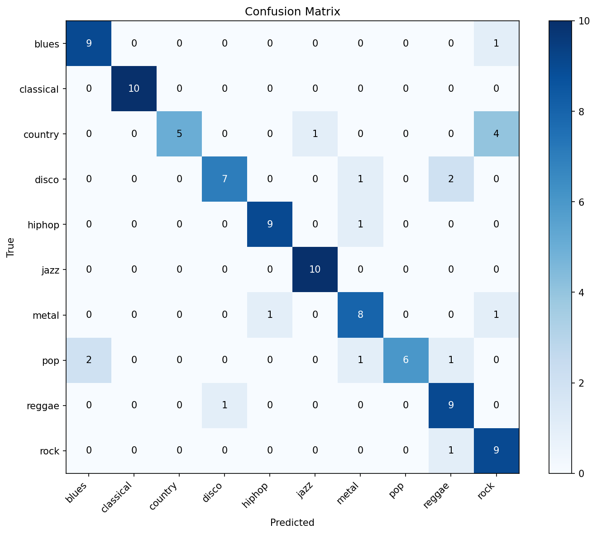
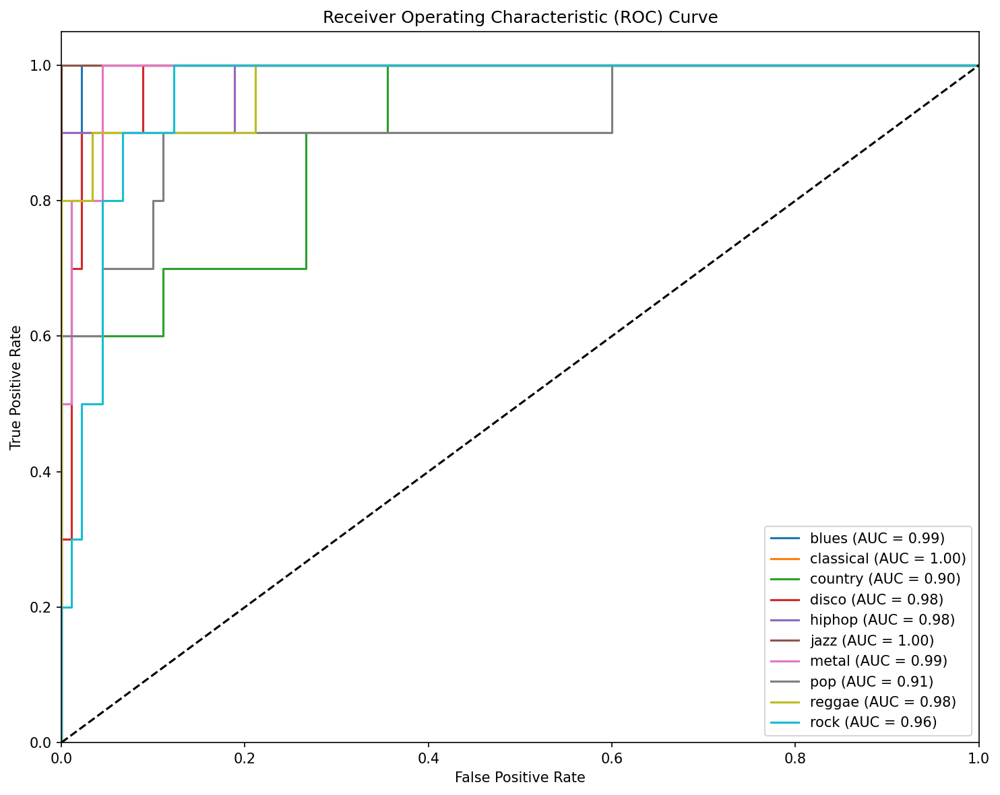
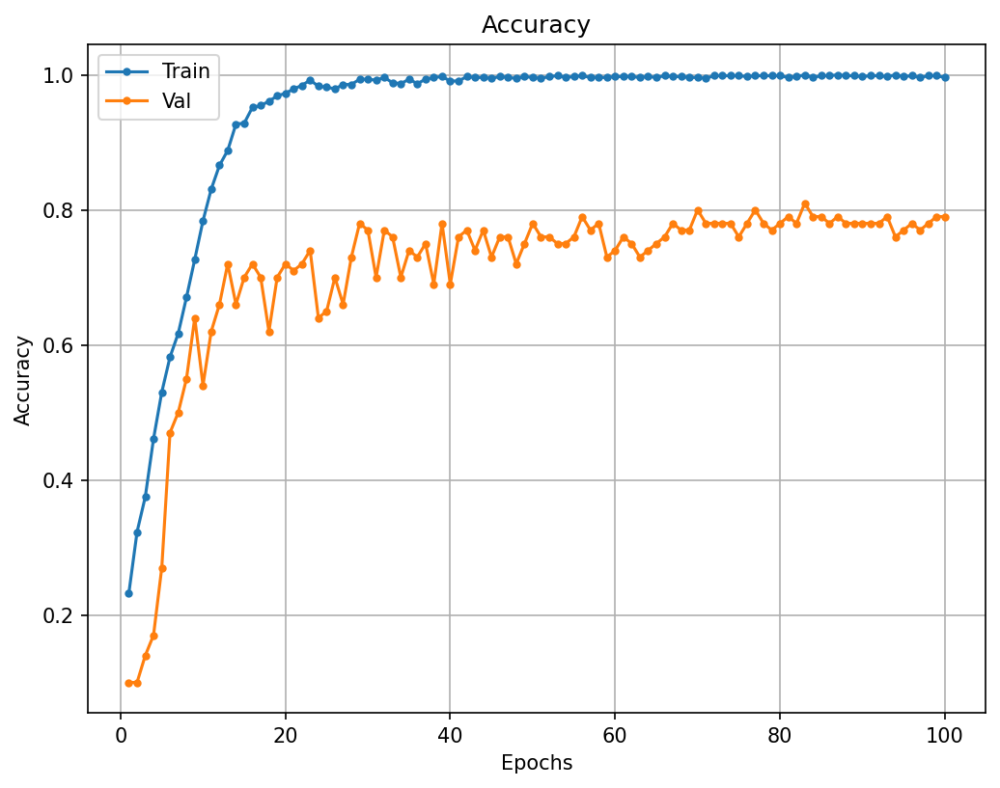

# 基于注意力机制和 ResNet18 的梅尔频谱音乐风格分类系统

## 项目简介

本项目是一个基于深度学习的音乐风格分类系统，使用 PyTorch 框架实现。通过将音频转换为梅尔频谱图，利用改进的 ResNet18 模型进行 10 分类音乐风格识别。项目包含完整的数据处理流程、多模型对比实验、性能评估和图形化推理界面，适合音频处理和深度学习的教学与实践。

## 项目背景与目标

### 背景
音乐风格分类是音频处理和音乐信息检索（MIR）领域的重要任务。传统方法依赖手工设计的特征，而深度学习方法能够自动学习音频的判别特征。梅尔频谱是一种广泛应用于音频处理的时频表示方法，能够更好地符合人类听觉特性。

### 目标
- 实现基于梅尔频谱的音乐风格分类系统
- 对比不同的模型改进策略（多尺度卷积、注意力机制）
- 构建完整的训练、评估和推理流程
- 提供易用的图形化推理界面

## 核心功能

### 1. 数据处理
- 支持 GTZAN 数据集（10 种音乐风格，1000 首歌曲）
- 两种数据版本：30 秒整段音频 vs 3 秒片段（每首歌 10 个片段）
- 自动的训练/验证/测试集划分（按原始音频划分，避免数据泄露）
- 实时梅尔频谱提取与 SpecAugment 数据增强

### 2. 模型架构
项目实现了 4 种 ResNet18 变体：

- **resnet18**：基线模型，标准 ResNet18 适配单通道梅尔频谱输入
- **resnet18_ms**：多尺度卷积改进版，在 layer3 和 layer4 中并行使用 1×1、3×3、5×5 卷积
- **resnet18_cbam**：CBAM 注意力改进版，在每个残差块后嵌入通道注意力和空间注意力
- **resnet18_ms_cbam**：混合改进版，结合多尺度卷积与 CBAM 注意力（最优模型）

### 3. 训练与评估
- 支持单实验训练或批量对比实验
- 完整的训练日志、混淆矩阵、ROC 曲线、训练曲线输出
- 多种评估指标：准确率、精准率、召回率、F1 分数、AUC

### 4. 推理界面
基于 PyQt5 的图形化推理界面，支持：
- 单文件预测：选择本地音频文件进行分类
- 录音预测：实时录制音频并进行分类
- 批量预测：批量处理多个音频文件
- 结果导出：将预测结果导出为 CSV 文件
- 可视化展示：显示音频波形、梅尔频谱和分类置信度

## 技术栈与系统结构

### 技术栈
- **深度学习框架**：PyTorch 2.x
- **音频处理**：torchaudio、librosa
- **数据处理**：pandas、numpy
- **图形界面**：PyQt5
- **可视化**：matplotlib、seaborn

### 系统结构
```
项目根目录
├── GTZAN/                    # 数据集目录
│   └── genres_original/      # 10 种音乐风格的原始音频
├── data/                     # 数据划分 CSV 文件
│   ├── split_30s/           # 30 秒版本的划分
│   └── split_3s/            # 3 秒版本的划分
├── models/                   # 4 种模型定义
│   ├── resnet18.py
│   ├── resnet18_ms.py
│   ├── resnet18_cbam.py
│   └── resnet18_ms_cbam.py
├── experiments/              # 训练输出与实验结果
├── gui/                      # PyQt5 界面代码
├── utils/                    # 推理与工具函数
├── dataset.py               # 数据加载与梅尔频谱提取
├── data_process.py          # 数据集划分脚本
├── train.py                 # 训练脚本
├── test.py                  # 测试脚本
├── run_all.py               # 批量实验脚本
├── main_window.py           # GUI 入口
└── plot.py                  # 可视化绘图脚本
```

## 关键实现

### 梅尔频谱提取
在 `dataset.py` 中实现实时梅尔频谱提取，配置参数为：
- 采样率：22050 Hz
- FFT 大小：1024
- Hop 长度：512
- Mel 频段数：128
- 频率范围：0-8000 Hz



### CBAM 注意力机制
CBAM（Convolutional Block Attention Module）由两部分组成：
- **通道注意力**：通过自适应平均池化和最大池化，使用 MLP 学习通道间的重要性
- **空间注意力**：通过卷积操作学习空间维度上的重要性

两个注意力模块串联应用，能够有效增强网络对关键特征的学习能力。



### 多尺度卷积
在残差网络的深层（layer3、layer4）中引入多尺度卷积分支，并行使用不同大小的卷积核（1×1、3×3、5×5），能够捕捉多个尺度的音频特征，提高模型的表达能力。

## 实验结果

### 性能对比

#### 30s 数据版本（按准确率排序）

| 模型 | 准确率 | 精准率 | 召回率 | F1 分数 | AUC |
|------|--------|--------|--------|---------|-----|
| **resnet18_ms_cbam** | **82.0%** | **85.2%** | **82.0%** | **81.7%** | **0.9696** |
| resnet18_ms | 79.0% | 79.7% | 79.0% | 78.8% | 0.9724 |
| resnet18 | 78.0% | 81.1% | 78.0% | 78.5% | 0.9728 |
| resnet18_cbam | 75.0% | 76.5% | 75.0% | 74.9% | 0.9631 |



#### 3s 数据版本（按准确率排序）

| 模型 | 准确率 | 精准率 | 召回率 | F1 分数 | AUC |
|------|--------|--------|--------|---------|-----|
| **resnet18_ms_cbam** | **77.2%** | **77.4%** | **77.2%** | **77.1%** | **0.9669** |
| resnet18_cbam | 77.0% | 77.6% | 77.0% | 76.8% | 0.9632 |
| resnet18 | 75.6% | 75.8% | 75.6% | 75.4% | 0.9599 |
| resnet18_ms | 74.0% | 74.6% | 74.0% | 73.9% | 0.9607 |



### 综合性能对比



### AUC 指标分析



### 最佳模型详细分析



最佳模型（resnet18_ms_cbam_30s）的混淆矩阵和 ROC 曲线如下：





### 训练过程可视化



### 关键发现

1. **30s 版本优于 3s 版本**：整体性能差异 3-5%，说明整段音频包含更多上下文信息
2. **混合改进最优**：多尺度卷积与 CBAM 注意力的结合达到最佳性能
3. **AUC 指标稳定**：所有模型 AUC > 0.96，说明分类能力较强
4. **改进效果显著**：相比基线模型，最优模型准确率提升 4%

## 项目亮点

1. **完整的实验框架**：从数据处理、模型训练、性能评估到推理部署，形成闭环
2. **系统的对比实验**：8 组实验（4 个模型 × 2 个数据版本），充分验证改进策略的有效性
3. **多维度的可视化**：提供混淆矩阵、ROC 曲线、训练曲线等多角度的性能分析
4. **易用的推理界面**：PyQt5 图形界面支持多种推理方式，降低使用门槛
5. **灵活的配置**：支持自定义模型参数、数据版本、训练策略

## 使用说明

### 环境要求
- Python 3.10+
- PyTorch 2.x（CPU 或 GPU）
- 其他依赖见 requirements.txt

### 快速开始
```bash
# 1. 数据处理
python data_process.py

# 2. 训练模型
python train.py --config train_config.json

# 3. 启动推理界面
python main_window.py
```

### 批量实验
```bash
# 一键运行所有 8 组对比实验（4 个模型 × 2 个数据版本）
python run_all.py
```

## 项目成果

### 生成的可视化图表

项目包含以下高质量的可视化图表，用于展示实验结果和模型性能：

#### 基础分析图表
- **CBAM 注意力机制架构图**：展示 CBAM 模块的结构设计
- **混淆矩阵**：最佳模型（resnet18_ms_cbam_30s）的分类结果分析
- **ROC 曲线**：多分类任务的 ROC 曲线展示
- **训练准确率曲线**：模型训练过程中的准确率变化

#### 模型对比图表
- **4 指标分组对比**：准确率、精准率、召回率、F1 分数的并排对比（30s vs 3s）
- **30s 版本详细对比**：4 个模型在 30s 数据上的详细性能对比
- **3s 版本详细对比**：4 个模型在 3s 数据上的详细性能对比
- **AUC 折线对比**：AUC 指标的趋势对比（折线图）
- **最佳模型展示**：最优模型的 5 个关键指标展示

#### 特征可视化
- **梅尔频谱示例**：展示项目使用的音频特征表示

## 后续改进方向

- 支持更多音频特征（MFCC、Chroma 等）
- 集成预训练模型（如 VGGish、PANNs）
- 增加更多数据增强策略
- 优化模型推理速度和内存占用
- 支持实时流式音频处理
- 扩展到其他音乐信息检索任务（如音乐推荐、艺术家识别等）
